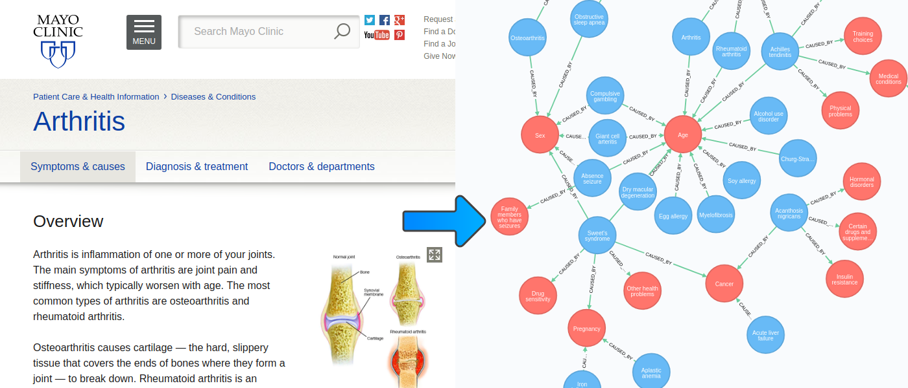

<h1 align="center">
  mayoclinic-scrapper
</h1>

<h4 align="center">Scrapping diseases information from <a href="https://www.mayoclinic.org/diseases-conditions/">Mayo Clinic</a> and saving it in <a href="https://neo4j.com/">Neo4j</a>

<p align="center">
  <a href="#setup">Setup</a> •
  <a href="#usage">Usage</a> •
  <a href="#data-format">Data format</a> •
  <a href="#possible-improvements">Possible improvements</a>
</p>



## Setup

This project has been developed using Python 3 (Python 2 may work). You need to install [Scrapy](https://scrapy.org/) and the [Neo4j Bolt Driver for Python](https://github.com/neo4j/neo4j-python-driver). Execute the following command in the project's root directory to install all the required dependencies (using a virtual environment is recommended):

```shell
pip install -r requirements
```

A running Neo4j instance is needed. For development purposes, the easiest way of starting an instance is running the official Neo4j Docker image using this command:

```shell
docker run --publish=7474:7474 --publish=7687:7687 --env=NEO4J_AUTH=none neo4j
```

## Usage

There are two scripts: `scraper.py` and `neo4j_importer.py`. The first one does not need any parameter and it will extract diseases data from the [Mayo Clinic's diseases and conditions index](https://www.mayoclinic.org/diseases-conditions/index), generating a JSON file. The second script receives this file as a parameter and will import the data into the Neo4j instance at http://localhost:7687. If you haven not used the command in the previous section to start Neo4j, make the necessary modifications in the second script.

Finally go to the Neo4j dashboard and start playing! For example, in the next gif you can see how the causes that are related with more than 3 diseases are retrieved:


## Data format

This file generated by the first script is a JSON Array containing the extracted diseases. An example of a disease is:

```json
{
   "disease_id": 0,
   "disease_name": "Sweet's syndrome",
   "causes": [
      {
         "cause_id": 0,
         "cause_name": "Sex"
      },
      {
         "cause_id": 1,
         "cause_name": "Age"
      },
      {
         "cause_id": 2,
         "cause_name": "Cancer"
      }
   ],
   "risk_factors": [
      {
         "risk_id": 0,
         "risk_name": "Sex"
      },
      {
         "risk_id": 1,
         "risk_name": "Age"
      },
      {
         "risk_id": 2,
         "risk_name": "Cancer"
      }
    ]
}
```

The data from this file is inserted in Neo4j with the following schema:

```text
(d:Disease { id, name })-[:CAUSED_BY]->(:Cause { id, name })
(d:Disease { id, name })-[:HAS_RISK]->(:RiskFactor { id, name })
```

## Possible improvements

The scrapping is imperfect. There are some disease's causes that should be processed as the same one. For example, _Smoking_ can also appear as _Smokin_ or _You smoke_. It would be cool to extract entities from the text and perform some fuzzy matching. Maybe using [NLTK](https://www.nltk.org/).

The same idea could be applied to extract the symptoms, since in the webpage the symptoms are contained in a free-text box as opposed to causes and risk factors that are bullet points.
